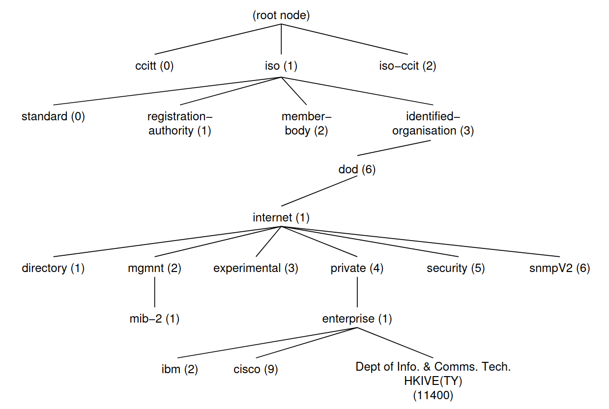

# infsnmp3

Wrapper for [PySNMP](http://snmplabs.com/pysnmp/index.html) library.

[](https://secure.travis-ci.org/aleasoluciones/infsnmp3)

<!-- TOC -->

- [infsnmp3](#infsnmp3)
  - [Development](#development)
    - [How to setup the development environment](#how-to-setup-the-development-environment)
    - [How to run the tests](#how-to-run-the-tests)
  - [SNMP concepts](#snmp-concepts)
    - [Managed device](#managed-device)
    - [MIB](#mib)
    - [OID](#oid)
    - [Data types](#data-types)
    - [Protocol operations](#protocol-operations)
    - [SNMP GetNext vs SNMP GetBulk](#snmp-getnext-vs-snmp-getbulk)
  - [infsnmp3 client API](#infsnmp3-client-api)
    - [get()](#get)
      - [Usage example](#usage-example)
      - [Equivalent command example](#equivalent-command-example)
    - [set()](#set)
      - [Usage example](#usage-example-1)
      - [Equivalent command example](#equivalent-command-example-1)
    - [walk()](#walk)
      - [Usage example](#usage-example-2)
      - [Equivalent command example](#equivalent-command-example-2)
    - [bulk_walk()](#bulk_walk)
      - [Usage example](#usage-example-3)
      - [Equivalent command example](#equivalent-command-example-3)

<!-- /TOC -->

## Development

### How to setup the development environment

- Create a virtual environment with [virtualenvwrapper](https://virtualenvwrapper.readthedocs.io/en/latest/) using Python 3.7+:

```sh
mkvirtualenv infsnmp3 -p $(which python3.7)
```

- Install the dependencies:

```sh
dev/setup_venv.sh
```

- In order to have something that behaves like a real device, we build and run a container executing the [SNMP Simulator Tool](http://snmplabs.com/snmpsim/) (snmpsim). It has been loaded with custom data and we can ask it for OIDs.

```sh
dev/start_infsnmp3_dependencies.sh
```

### How to run the tests

```sh
dev/all_tests.sh
```

## SNMP concepts

### Managed device

A managed device resides on a managed network and is usually represented as one of the many nodes of the network. Such devices can be routers, access servers, switches, bridges, hubs, computer hosts, printers, and even all kinds of IoT devices that "speak" SNMP.

It is even possible to install a SNMP server in any Linux or Windows system and use it to management purposes.

### MIB

**MIB** stands for **Management Information Base** and is a collection of information organized hierarchically. These are accessed using a protocol such as SNMP. There are two types of MIBs: scalar and tabular.

Scalar objects define a single object instance whereas tabular objects define multiple related object instances grouped in MIB tables.

MIBs are collections of definitions which define the properties of the managed object within the device to be managed.

An online MIB Browser is available [here](https://bestmonitoringtools.com/mibdb/mibdb_search.php).

### OID

**OIDs** stands for **Object Identifiers**. OIDs uniquely identify managed objects in a MIB hierarchy. This can be depicted as a tree, the levels of which are assigned by different organizations. Top level MIB object IDs (OIDs) belong to different standard organizations.

Vendors define private branches including managed objects for their own products.



Generally, an OID is a long sequence of numbers that code the nodes, and are separated by dots. Here is a sample structure of an OID:

```
Iso(1).org(3).dod(6).internet(1).private(4).transition(868).products(2).chassis(4).card(1).slotCps(2)­.-cpsSlotSummary(1).cpsModuleTable(1).cpsModuleEntry(1).cpsModuleModel(3).3562.3
```

or just

```
1.3.6.1.4.868.2.4.1.2.1.1.1.3.3562.3
```

### Data types

**Abstract Syntax Notation One (ASN.1)** is a standard interface description language for defining data structures that can be serialized and deserialized in a cross-platform way.

Pure ASN.1 types:

    INTEGER
    OCTET STRING
    OBJECT IDENTIFIER

SNMP-specific subtypes of those base ASN.1 types:

    Integer32/Unsigned32 - 32-bit integer
    Counter32/Counter64 - ever increasing number
    Gauge32 - positive, non-wrapping 31-bit integer
    TimeTicks - time since some event
    IPaddress - IPv4 address
    Opaque - uninterpreted ASN.1 string

### Protocol operations

SNMP is designed around a client-server model. Both managing and managed entities contain client and server components. Clients and servers exchange data in a name-value form. Values are strongly typed.

Two modes of protocol operation are defined:

    Request-response messages
    Unsolicited messages

Protocol carries SNMP messages. Besides header information used for protocol operations, management information is transferred in so-called Protocol Data Units (PDU). Seven PDU types are defined in SNMP addressing conceptually different operations to be performed.

    Manager-to-agent
        GetRequest, SetRequest, GetNextRequest, GetBulkRequest, InformRequest
    Manager-to-manager
        InformRequest, Response
    Agent-to-manager
        SNMPv2-Trap, Response

### SNMP GetNext vs SNMP GetBulk

GetNext and GetBulk are similar command options, but they have main differences.

GetBulk is significantly more efficient than other messages when multiple consecutive values need to be obtained. The best practice is to use them whenever possible.

Also, note that if all we want to do is perform consecutive GetNext operations in a GetBulk request, we'll need to set the non-repeater value to 0.

With GetNext, we need to keep asking for each item one-by-one until it reaches the end of the list. So, for example, if we want to get a list of all interfaces names from a device, then this means that we might end up sending 20 requests (or how many interface names this device might have - 2, 10, or even 30) might go out to the agent and 20 replies are sent back.

When using GetBulk requests, we will send one request only asking for an item and all following items up to a limit. Usually, the number of requests is greatly reduced through GetBulk. In some scenarios, the complete data set com potentially be returned with just one request/reply pair, but we normally won't know until we've sent the Get request.

GetBulk provides some savings in terms of bandwidth. But, even more importantly, it also reduces the effects of a long wait for responses (latency time).

## infsnmp3 client API

Below is described the public API that this library provides. To run the examples, the [snmpsim](https://github.com/etingof/snmpsim) server (run `dev/start/infsnmp3_dependencies.sh`) which can emulate a real device, has to be up. The snmpsim server is feeded with [these files](/integration_tests/snmpsim/simulated_data/). For the following examples, we use the ones accesible under the "public" community (the community is the name of each file). The simulation data files can be created or edited following [this guide](https://github.com/etingof/snmpsim/blob/master/docs/source/documentation/managing-simulation-data.rst).

In order to use the [command-line SNMP utils](http://www.net-snmp.org/wiki/index.php/Main_Page):

```bash
sudo apt install snmp
```

### get()

In our implementation we ask for a list of OIDs, which can contain one or more. It returns the same amount of results.

> snmp_client.**get**(*host*, *community*, *oids*, **kwargs*)

➡️ Parameters

- **host**: `str`
- **community**: `str`
- **oids**: `list<str>`
- **port** (optional): `int`. Defaults to `161`.
- **timeout** (optional): `int`. Defaults to `2`.
- **retries** (optional): `int`. Defaults to `2`.

⬅️ Returns a list of tuples, each containing an OID and a [PySnmpValue](/infsnmp/types.py#L11) object.

`list<tuple<str, PySnmpValue>>`

💥 Throws *SNMPLevelError*, *SNMPSocketError*, *InvalidOIDError*

#### Usage example

```python
from infsnmp.clients import PySnmpClient

PySnmpClient().get('127.0.0.1', 'public', [
    '1.3.6.1.2.1.1.1.0',
    '1.3.6.1.2.1.2.1.0'
], port=1161)
```

#### Equivalent command example

```bash
snmpget -v2c -c public 127.0.0.1:1161 1.3.6.1.2.1.1.1.0
snmpget -v2c -c public 127.0.0.1:1161 1.3.6.1.2.1.2.1.0
```

---

### set()

In our implementation we need to provide a list of tuples, indicating the OID and its value. This value needs to be typed. We can use the class [PySnmpTypes](/infsnmp/types.py#L70) for that, whose methods wrap the **rfc1902** types provided by **pysnmp**.

```
'OID:': rfc1902.ObjectName,
'NULL:': univ.Null,
'INTEGER:': rfc1902.Integer,
'STRING:': rfc1902.OctetString,
'BITS:': rfc1902.Bits,
'HEX-STRING:': rfc1902.OctetString,
'GAUGE32:': rfc1902.Gauge32,
'COUNTER32:': rfc1902.Counter32,
'COUNTER64:': rfc1902.Counter64,
'IPADDRESS:': rfc1902.IpAddress,
'OPAQUE:': rfc1902.Opaque,
```

> snmp_client.**set**(*host*, *community*, *snmp_values*, **kwargs*)

➡️ Parameters

- **host**: `str`
- **community**: `str`
- **snmp_values**: `list<tuple<str, rfc1902.any>>`
- **port** (optional): `int`. Defaults to `161`.
- **timeout** (optional): `int`. Defaults to `2`.
- **retries** (optional): `int`. Defaults to `2`.

⬅️ Returns None

💥 Throws *SNMPLevelError*, *SNMPSocketError*

#### Usage example

```python
from infsnmp.clients import PySnmpClient
from infsnmp.types import PySnmpTypes

PySnmpClient().set('127.0.0.1', 'public', [
    ('1.3.6.1.2.1.1.9.1.3.1', PySnmpTypes().octect_string(b'hello')),
    ('1.3.6.1.2.1.2.1.0', PySnmpTypes().integer(36)),
], port=1161)
```

#### Equivalent command example

```bash
snmpset -v2c -c public 127.0.0.1:1161 1.3.6.1.2.1.1.9.1.3.1 s 'hello'
snmpset -v2c -c public 127.0.0.1:1161 1.3.6.1.2.1.2.1.0 i 36
```

---

### walk()

> snmp_client.**walk**(*host*, *community*, *str_oid*, **kwargs*)

➡️ Parameters

- **host**: `str`
- **community**: `str`
- **str_oid**: `str`
- **port** (optional): `int`. Defaults to `161`.
- **timeout** (optional): `int`. Defaults to `2`.
- **retries** (optional): `int`. Defaults to `2`.

⬅️ Returns a list of tuples, each containing an OID and a [PySnmpValue](/infsnmp/types.py#L11) object.

`list<tuple<str, PySnmpValue>>`

💥 Throws *SNMPLevelError*, *SNMPSocketError*

#### Usage example

```python
from infsnmp.clients import PySnmpClient

PySnmpClient().walk('127.0.0.1', 'public', '1.3.6.1.2.1', port=1161)
```

#### Equivalent command example

```bash
snmpwalk -v2c -c public 127.0.0.1:1161 1.3.6.1.2.1
```

---

### bulk_walk()

In addition to requesting the OID that is in every SNMP request type, GetBulk has two additional capabilities. They are **non-repeaters** (how many OIDs in the request should be treated as Get request variables) and **max-repetitions** (how many GetNext operations to perform on each variable that is not covered by non-repeaters option).

> snmp_client.**bulk_walk**(*host*, *community*, *str_oid*, **kwargs*)

➡️ Parameters

- **host**: `str`
- **community**: `str`
- **str_oid**: `str`
- **port** (optional): `int`. Defaults to `161`.
- **timeout** (optional): `int`. Defaults to `2`.
- **retries** (optional): `int`. Defaults to `2`.
- **non_repeaters** (optional): `int`. Defaults to `0`.
- **max_repetitions** (optional): `int`. Defaults to `50`.

⬅️ Returns a list of tuples, each containing an OID and a [PySnmpValue](/infsnmp/types.py#L11) object.

`list<tuple<str, PySnmpValue>>`

💥 Throws *SNMPLevelError*, *SNMPSocketError*

#### Usage example

```python
from infsnmp.clients import PySnmpClient

PySnmpClient().bulk_walk('127.0.0.1', 'public', '1.3.6.1.2.1', port=1161)
```

#### Equivalent command example

```bash
snmpbulkwalk -v2c -c set 127.0.0.1:1161 1.3.6.1.2.1
```
